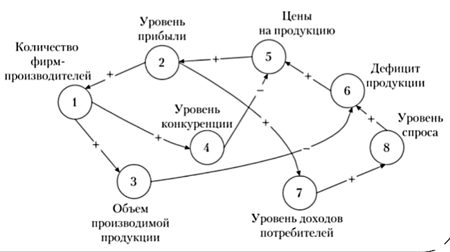
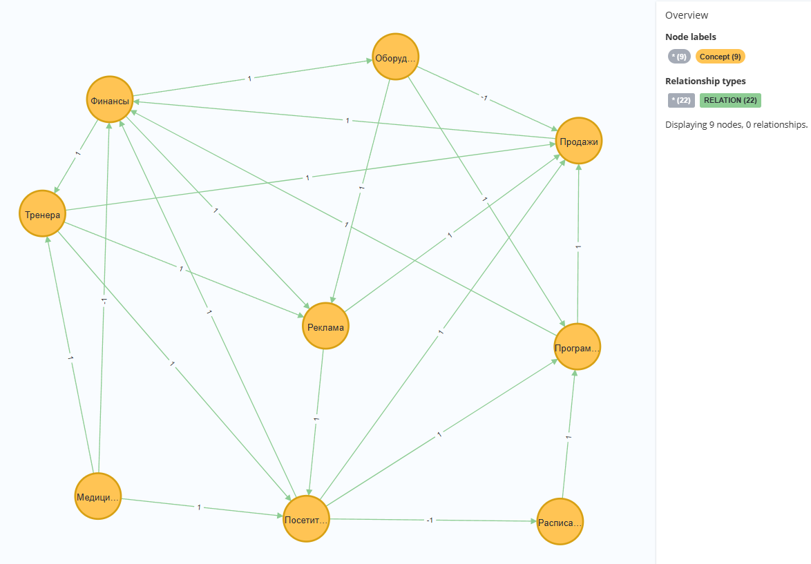

## Визуальное отображение когнитивной модели с помощью Neo4j

Под четкой когнитивной моделью понимается когнитивная карта 
(знаковый ориентированный граф), которая получается путем структуризации 
знаний руководителя, исполнителей проекта на основе теоретических 
представлений, исходных данных, применения различных экспертных методов.

G = <V, E>

где V - множество вершин, 
E – бинарное отношение на V (дуги (связи) между вершинами v_i и v_j).
Элементы e_ij характеризуют направление и силу влияния между вершинами v_i и v_j.

Когнитивная модель G может быть представлена матрицей отношений E,
которая представляет собой квадратную матрицу, причем элемент матрицы E,
стоящий на пересечении i-й строки и j-го столбца, может принимать значения 1, -1, либо 0.

Для установления связей определена шкала для оценки характера и силы связи между вершинами, 
где вербальному описанию связи присваивается число.

## Оценка связей между вершинами

| Вербальное описание                             | Численное значение |  
|-------------------------------------------------|--------------------|  
| Увеличение/увеличение Уменьшение/уменьшение | 1                  |  
| Увеличение/уменьшение Уменьшение/увеличение | -1                 |
| Отсутствует                                     | 0                  |

1. Символ «1» обозначает положительную связь между вершинами v_i и v_j,
т.е. увеличение (уменьшение) влияния вершины v_i вызывает увеличение 
(уменьшение) в вершине v_j; 
2. Символ «-1» означает отрицательную связь между v_i и v_j, 
т.е. увеличение (уменьшение) влияния вершины v_i вызывает уменьшение (увеличение) в вершине v_j;
3. Символ «0» означает, что влияние v_i на v_j отсутствует.

### Пример

### Предметная область для примера - Фитнес центр
#### Вершины:
1. Посетители
2. Тренера
3. Оборудование
4. Программы тренировок
5. Расписание занятий
6. Финансы
7. Медицина
8. Реклама
9. Продажи

#### В src/main/resources/models/cognitive-model.xlsx можно найти матрицу отношений

#### Вид графа
